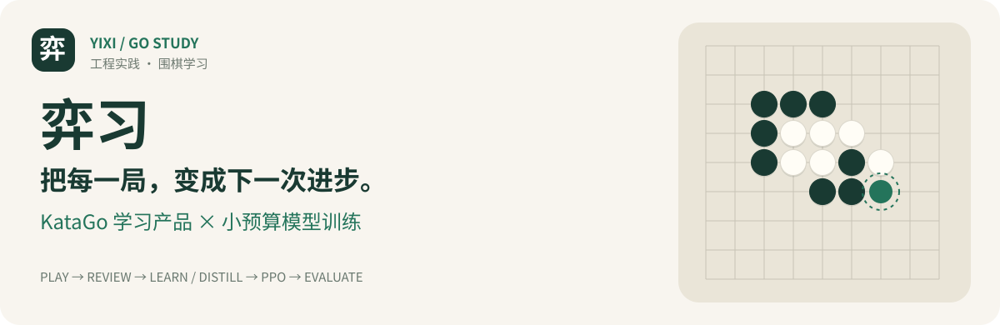
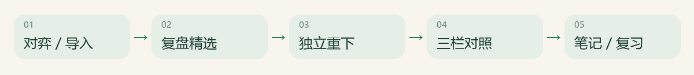
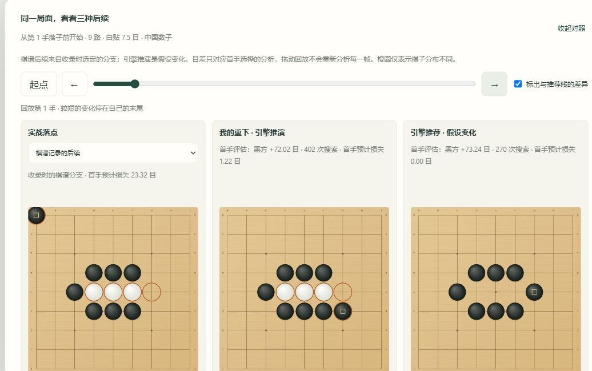
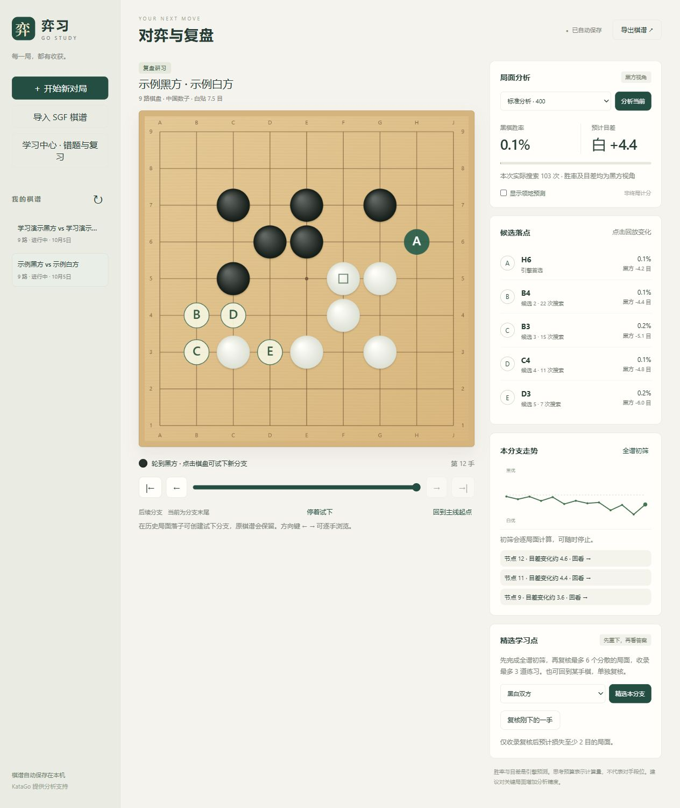
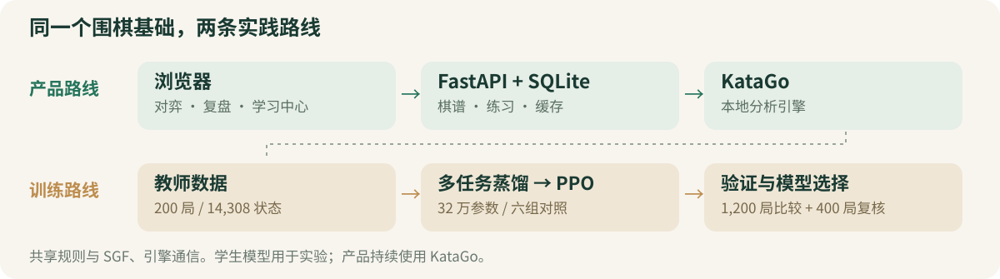
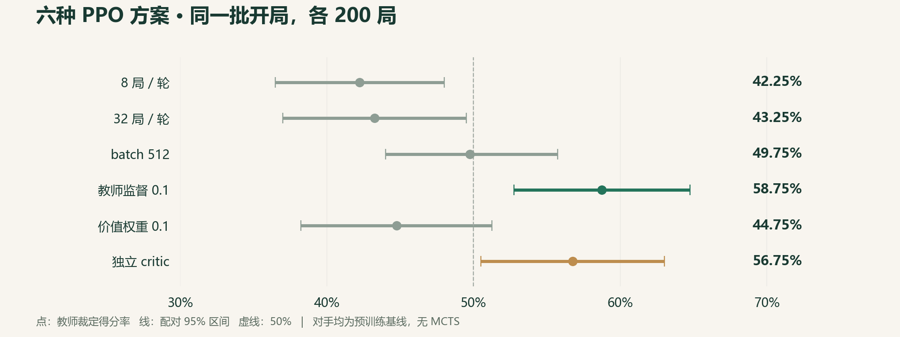

<p align="center">
  
</p>

<p align="center">
  <a href="README-product.md">产品使用</a> ·
  <a href="README-train.md">训练实验</a> ·
  <a href="docs/PROJECT.md">项目经历</a> 
</p>

**一个可以使用的围棋学习产品，一套可以解释结果的模型训练实践。**

产品用 KataGo 帮助棋友复盘与练习；训练用小型学生网络实践蒸馏、PPO 和对照评估。

| 9 / 13 / 19 路 |    14,308 个状态    |    6 组 PPO 对照    |       1,600 局评估       |
| :------------: | :-----------------: | :-----------------: | :-----------------------: |
| 对弈与分支复盘 | 来自 200 局教师棋谱 | 每组 3 轮，逐项诊断 | 最终比较 1,200 + 复核 400 |

## 01 · 让复盘进入下一次练习





<sub>真实界面 · 独立演示库 · 人工构造 SGF。左为棋谱记录，中/右为引擎推演；橙圈显示局面差异。</sub>

| 能力                      | 用户得到什么                                             |
| ------------------------- | -------------------------------------------------------- |
| **对弈 / 分支复盘** | 自动存档、SGF 导入导出、候选与走势，试下保留原谱         |
| **精选 / 独立重下** | 复核实战落点，先思考后看答案，接近参考的其他下法也可通过 |
| **三栏变化对照**    | 同步回放实战、自己的选择与推荐；观察提子与局面差异       |
| **学习中心**        | 笔记、8 类手动标签、7/30 天统计、1/3/7 天到期复习        |

<details>
<summary>展开查看：完整对弈与复盘界面</summary>



</details>

## 02 · 从教师蒸馏，到可诊断的 PPO



**32 万参数 · 11 通道输入 · 策略 / 价值 / 目差 / 领地四项输出**

| 预训练                                  | 后训练                      | 实验工程                         |
| --------------------------------------- | --------------------------- | -------------------------------- |
| 多任务蒸馏、D4 增强、混合精度           | PPO clip + 冻结参考 KL      | 来源哈希、断点恢复、完整逐轮日志 |
| 教师首选一致率**2.91% → 27.37%** | 教师监督重放 / 价值梯度隔离 | 同开局交换黑白、区间与新样本复核 |



**最终保留：教师监督 0.1 的 PPO 候选，同时保留预训练基线。** 新批次 200 局得分 **56.25%**，95% 区间 **49.75%～62.75%**；较早一批为 **48.25%**，完整保留负结果。

<sub>以上是对预训练模型的教师裁定得分率，无 MCTS，不是段位或正式胜率。每配置一个训练种子；验证集约 8.9% 的行共享早期开局。当前按预算收尾，尚未证明稳定优势或数学收敛。 · </sub>

## 03 · 值得展开讲的工程细节

| 问题                        | 实际解决方式                                        |
| --------------------------- | --------------------------------------------------- |
| 只采到黑方状态              | 逐手保存，并检查采集、续采及两个数据分区的黑白覆盖  |
| 扩采也扩大了更新预算        | 用 batch 对照控制更新次数，再分别测试重放与价值梯度 |
| 原谱变化 / 重复提交影响练习 | 独立快照、可重试且不重复计次的提交、引擎身份缓存    |
| 换电脑后 Python 路径失效    | 启动前实际探测解释器，保留旧环境并在本机重建        |

`FastAPI` · `SQLite` · `原生 JavaScript / Canvas` · `KataGo` · `PyTorch` · `保留的 C++ MCTS`

已记录阶段验收：**62 项产品 Python 测试 · 21 组前端检查 · 4 项启动器测试 · 30 项训练测试**，另有真实引擎与训练审计。当前为本地单用户版本；截图覆盖桌面演示流程，完整浏览器与移动端验收仍待补充。

## 开始体验

1. Windows 安装 **Python 3.10+**，按[引擎安装说明](katago_engine/INSTALL.md)准备 KataGo、模型与兼容驱动。
2. 在项目目录运行下方启动器，等待首次依赖安装，保持窗口开启。
3. 打开 http://127.0.0.1:8000，导入 [复盘演示](examples/review-demo.sgf) 或 [学习演示](examples/study-demo.sgf)。

```powershell
.\start-product.cmd
```

产品不需要 PyTorch；训练环境、复现命令见 [README-train.md](README-train.md)。源码不包含用户数据、虚拟环境或模型二进制，所有本机资源继续保留。

---

[产品与规则说明](README-product.md) · [训练与结果边界](README-train.md) · [项目叙事与面试要点](docs/PROJECT.md)
