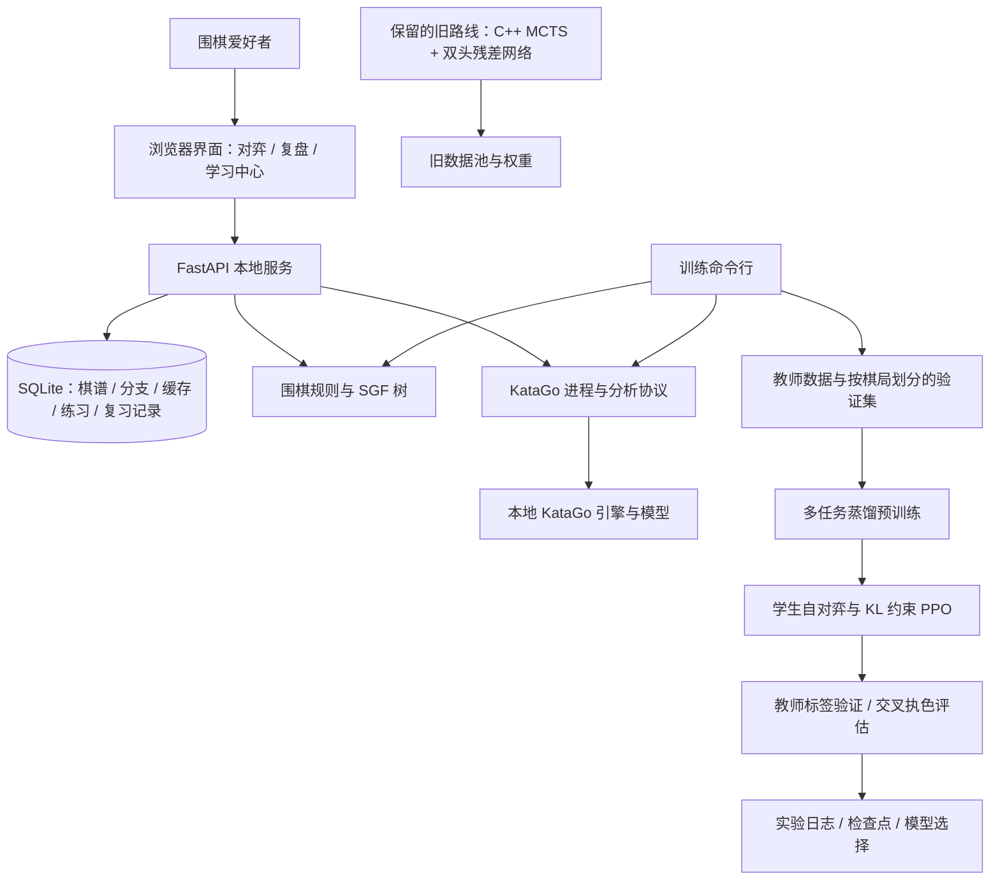

# 弈习：围棋学习产品与模型训练

一个围绕“怎样用 AI 帮助人学围棋，以及怎样亲手训练一个围棋模型”展开的双路线项目。

**产品路线**将本地 KataGo 的分析能力组织成“对弈 → 复盘 → 精选学习点 → 独立重下 → 对照变化 → 到期复习”的学习流程。**训练路线**保留原有 C++ MCTS 自对弈实现，新增小型网络的教师蒸馏预训练、PPO 后训练与对照实验，实践从数据生成到模型选择的完整过程。

产品完成四阶段开发及 Windows 启动器迁移修复；训练完成 200 局教师数据、10 个 epoch 预训练、六组 PPO 对照和最后 1,600 局统一比较与复核，进入阶段性收尾。

| 阅读入口                               | 内容                                                         |
| -------------------------------------- | ------------------------------------------------------------ |
| [产品开发与使用记录](../README-product.md) | 四阶段功能演进、操作方法、判分与统计口径、安装迁移、验证边界 |
| [训练方法与实验记录](../README-train.md)   | 数据问题修复、预训练、六组后训练、评估结论、复现命令与日志   |

## 为什么分成两条路线

围棋爱好者需要的不只是一个强对手，还需要知道值得复习什么、重新思考后怎样判断进步。因此产品以成熟的 KataGo 为分析引擎，把重点放在学习流程、数据一致性和交互设计上。

自行训练的目标则是建立可解释、可复查的训练实践，在单机预算内学习数据质量控制、监督学习、在线策略优化和实验评估。学生模型目前只用于实验，产品继续使用 KataGo；两条路线共享围棋规则与引擎通信基础设施。

## 整体架构



这里的 KataGo API 指本地 Analysis Engine 协议，以及项目在其外层提供的 HTTP 接口，无需远程推理服务。

## 产品：让复盘结果进入下一次练习

| 开发阶段            | 用户能力                                                     | 关键实现                                                             |
| ------------------- | ------------------------------------------------------------ | -------------------------------------------------------------------- |
| 1. 对弈与复盘基础   | 9/13/19 路对弈、存档、SGF 导入导出、分支试下、候选变化回放   | 规则与引擎一致；棋谱树保存分支；分析缓存与引擎请求管理               |
| 2. 精选、重下与复习 | 从自己的棋谱收录学习点，独立作答、查看反馈、记笔记、按期复习 | 实战落点受限搜索复核；不可变题目快照；提交可重试且不重复计次         |
| 3. 学习中心         | 7/30 天及全部统计、每日记录、知识点筛选、作答历史            | 区分作答与看答案；按不同题目的最近结果汇总；手动标签与完成时间兼容   |
| 4. 三栏变化对照     | 同步查看棋谱后续、自己的重下与引擎推荐                       | 区分真实记录和假设推演；合法回放、差异标记、提子统计与旧记录按需补算 |
| 迁移修复            | 换电脑后重建 Python 环境并启动                               | 实际探测解释器可用性，保留失效环境，发现本机 Python 后重建           |

例如，用户导入一盘自己的棋，初筛后复核一手预计损失较大的落子。系统保存该局面的快照，作答前隐藏答案；用户重下后可以比较三条变化、标注“官子”等知识点并写笔记。之后通过到期复习和学习中心回顾结果，形成可持续使用的个人学习记录。

判分使用有限搜索下的预计目差，允许接近参考效果的其他下法通过；它不是唯一正确答案证明。知识点由用户手动标注，尚未提供自动棋理解释或棋力等级评定。

## 训练：从能运行到能解释结果

训练协议固定为 9 路、中国面积规则、白贴 7.5 目。基础学生网络有 **320,251 个参数**，使用 11 通道输入与策略、价值、目差、领地四项输出。

1. **先验证数据。** 首次 20 局发现每隔 4 手采样只保存黑方状态；改为逐手保存，增加采集、续采及训练/验证分区的黑白覆盖检查，再重新采集。
2. **建立监督基线。** 冻结 200 局、14,308 个状态，按完整棋局划分为训练 170 局与验证 30 局；完成 10 个 epoch、950 次更新。
3. **逐项优化后训练。** 依次比较每轮采样量、batch 大小、教师监督重放、价值损失权重和价值梯度隔离，每项完成后先诊断再推进。
4. **用统一协议选模型。** 固定六个第三轮检查点，在同一批新开局上各评估 200 局，再为两个候选各追加 200 局新开局复核，保留负结果和不确定性。

| 可核对的结果         | 记录                                                                   |
| -------------------- | ---------------------------------------------------------------------- |
| 教师数据             | 200 局 / 14,308 状态；黑 7,215、白 7,093                               |
| 预训练验证总损失     | 4.7632 → 3.4295                                                       |
| 与教师首选动作一致率 | 2.91% → 27.37%                                                        |
| 后训练对照           | 六组，各 3 轮；共同评估 1,200 局，最终复核 400 局                      |
| 最终保留的 PPO 候选  | 教师监督重放权重 0.1；共同评估得分率 58.75%，新批次复核 56.25%         |
| 最后复核的不确定性   | 上述 56.25% 的配对 95% 区间为 49.75%～62.75%，尚不足以独立确认稳定优势 |

**评估口径：** 候选分别与同一个预训练基线对弈，同开局交换黑白，双方直接按策略落子且不加 MCTS；最后由 KataGo 估值裁定得分。因此这里报告的是“教师裁定得分率”，不是正式胜率、Elo 或段位。教师监督候选在较早一批 200 局上为 48.25%，这一负结果同样保留。

预训练验证集中约 8.9% 的行与训练集共享早期开局状态，拟合指标可能偏乐观。每种配置只有一个训练种子、三轮 PPO；当前结论是预算内的阶段性收尾，不能称为数学收敛或证明更大模型、更多训练无效。完整数据、消融表和保留模型路径见[训练记录](../README-train.md)。

## 技术栈与代码导航

| 层次               | 技术 / 主要文件                                                                               |
| ------------------ | --------------------------------------------------------------------------------------------- |
| 页面与交互         | 原生 HTML、CSS、JavaScript；`index.html`、`app.js`、`style.css`                         |
| 本地服务与存储     | FastAPI、Uvicorn、SQLite；`server.py`                                                       |
| 规则与棋谱         | Python、sgfmill；`go_game.py`                                                               |
| 引擎适配           | KataGo Analysis Engine、进程通信、请求匹配、超时；`katago_service.py`                       |
| 学习统计与变化对照 | `study_stats.py`、`study_compare.py`                                                      |
| 新训练系统         | PyTorch、NumPy；`train_v2.py`、`train_v2_common.py`、`train_v2_config*.json`            |
| 旧训练系统         | C++ MCTS、双头残差网络、文件数据池；`cpp_src/`、`worker_selfplay.py`、`worker_train.py` |
| 验证               | Python unittest、前端模拟 DOM 测试、真实引擎集成脚本；`tests/`                              |

## 快速体验产品

当前启动方式面向 Windows：安装 Python 3.10 或更高版本，并准备可运行的本地 KataGo OpenCL 引擎、兼容显卡驱动和模型。

本地完整项目中的引擎文件约定为：

```text
katago_engine/
  katago.exe
  kata1-b28c512nbt-s12192929536-d5655876072.bin.gz
  product_analysis.cfg
  ...引擎发行包所需的依赖文件
```

在项目目录双击 `start-product.cmd`，或在 PowerShell 中运行：

```powershell
.\start-product.cmd
```

启动器检查并准备本机 Python 环境，首次安装依赖需要联网。保持窗口开启，在浏览器访问 **http://127.0.0.1:8000**。首次启动引擎可能需要显卡调优。

导入 [review-demo.sgf](../examples/review-demo.sgf) 体验分支复盘；使用 [study-demo.sgf](../examples/study-demo.sgf) 体验学习点、重下和变化对照。这些是功能演示棋谱，不是标准棋理教材。完整操作与迁移步骤见[产品说明](../README-product.md)。

训练需要另行安装 PyTorch，按[训练复现步骤](../README-train.md#复现与日常操作)执行。产品本身不依赖 PyTorch 或旧 C++ 扩展。

## 验证与可复现材料

已记录的阶段验收包括：产品第四阶段 62 项 Python 测试、21 组前端语法/模拟 DOM 检查及真实 KataGo 集成流程；后续启动器 4 项 Windows 专项测试；训练路线最终 30 项专项测试和实际采集、训练、评估审计。它们来自各阶段的验收记录，并非本次文档整理重新运行的结果。

前端尚未完成真实浏览器视觉、鼠标与手机触控验收，产品仍需用户试用。当前是本地单用户工具，没有多账号隔离或跨设备同步。

实验记录包含完整配置、环境、源码和教师文件哈希、分片校验、随机状态、优化器状态与逐轮检查点。`train_v2_runs/`、`train_v2_data/`、`product_data/` 和虚拟环境已被 `.gitignore` 排除；GitHub 页面上的两份分路线 README 保留核心结果，原始数据、模型、用户棋谱和详细实验报告不应被假定随源码自动提供。本地 KataGo 模型约 271 MB，发布时需另行安排引擎与模型的分发，并遵循其各自许可；本 README 不代表已经提供可下载的模型发布包。

## 项目经历与可讨论的工程问题

- **全栈流程设计：** 将引擎分析接入棋谱树、题目快照、幂等提交与复习计划，处理“重复请求是否重复计次”“原棋谱变化是否改变旧题”等一致性问题。
- **数据质量：** 通过小规模采样发现黑白覆盖缺陷，将修复扩展为采集、续采、载入三个环节的检查；按棋局划分后继续审计共同开局重叠。
- **训练与恢复：** 实现多任务蒸馏、合法动作掩码、D4 增强、混合精度、KL 约束 PPO，以及带配置和数据来源校验的恢复机制。
- **实验设计：** 识别“增加采样同时增加更新次数”的混杂因素，以 batch 对照控制更新预算；用统一开局、交叉执色和新样本复核约束结论。
- **多目标取舍：** 教师监督候选的观察对局得分更高，价值梯度隔离更好地保留目差预测；说明估值拟合与对弈表现必须分别衡量。

可用于项目经历的概述：开发基于 KataGo 的本地围棋学习产品，完成对弈复盘、错题重下、复习统计和三栏变化对照；同时搭建 9 路围棋多任务蒸馏与 PPO 训练闭环，完成 200 局教师数据预训练、六组后训练对照及 1,600 局统一比较与复核，实现可追溯实验记录，并在统计不确定性与能力保留约束下完成模型选择。
